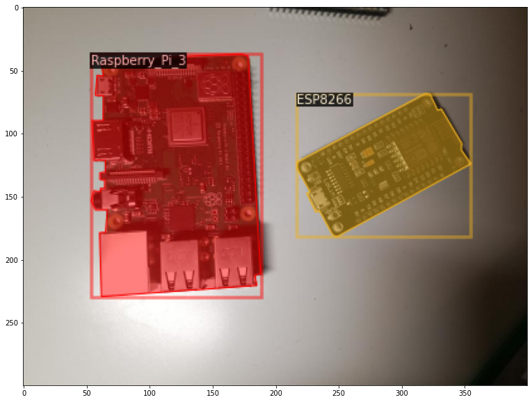
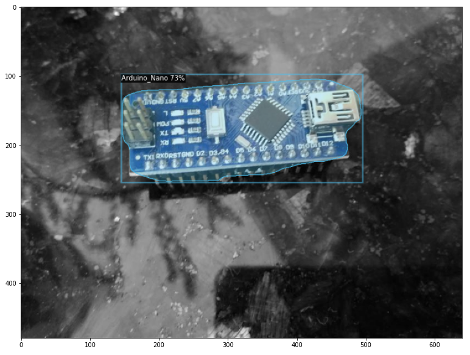

# Detectron2 Train a custom Instance Segmentation Model



## 1. Installation

See the official [installation guide](https://github.com/facebookresearch/detectron2/blob/master/INSTALL.md).

## 2. Gathering data

Gathering image data is simple. You can either take pictures yourself using some kind of camera, or you can download images from the internet.

To build a robust model, you need pictures with different backgrounds, varying lighting conditions as well as random objects in the background.

For my microcontroller data-set, I have four different objects ((Arduino Nano, ESP8266, Raspberry Pi 3, Heltect ESP32 Lora). I took about 25 pictures of each microcontroller and 25 containing multiple microcontrollers using my smartphone. After taking the pictures, make sure to transform them to a resolution suitable for training (I used 800x600).

## 3. Labeling data

After you have gathered enough images, it's time to label them, so your model knows what to learn. In order to label the data, you will need to use some kind of labeling software.

For object detection, we used [LabelImg](https://github.com/tzutalin/labelImg), an excellent image annotation tool supporting both PascalVOC and Yolo format. For Image Segmentation / Instance Segmentation there are multiple great annotations tools available. Including, [VGG Image Annotation Tool](http://www.robots.ox.ac.uk/~vgg/software/via/), [labelme](https://github.com/wkentaro/labelme), and [PixelAnnotationTool](https://github.com/abreheret/PixelAnnotationTool). I chose labelme, because of it's simplicity to both install and use.


## 4. Registering the data-set

Detectron2 gives you multiple options to register your instance segmentation data-set. Which one you use will depend on what data you have. If you labeled your data with labelme or the VGG Image Annotation Tool I recommend you to pass the ```segmentation``` parameter as shown below for the microcontroller data-set:

```python
import os
import numpy as np
import json
from detectron2.structures import BoxMode

def get_microcontroller_dicts(directory):
    classes = ['Raspberry_Pi_3', 'Arduino_Nano', 'ESP8266', 'Heltec_ESP32_Lora']
    dataset_dicts = []
    for filename in [file for file in os.listdir(directory) if file.endswith('.json')]:
        json_file = os.path.join(directory, filename)
        with open(json_file) as f:
            img_anns = json.load(f)

        record = {}
        
        filename = os.path.join(directory, img_anns["imagePath"])
        
        record["file_name"] = filename
        record["height"] = 600
        record["width"] = 800
      
        annos = img_anns["shapes"]
        objs = []
        for anno in annos:
            px = [a[0] for a in anno['points']]
            py = [a[1] for a in anno['points']]
            poly = [(x, y) for x, y in zip(px, py)]
            poly = [p for x in poly for p in x]

            obj = {
                "bbox": [np.min(px), np.min(py), np.max(px), np.max(py)],
                "bbox_mode": BoxMode.XYXY_ABS,
                "segmentation": [poly],
                "category_id": classes.index(anno['label']),
                "iscrowd": 0
            }
            objs.append(obj)
        record["annotations"] = objs
        dataset_dicts.append(record)
    return dataset_dicts

from detectron2.data import DatasetCatalog, MetadataCatalog
for d in ["train", "test"]:
    DatasetCatalog.register("microcontroller_" + d, lambda d=d: get_microcontroller_dicts('Microcontroller Segmentation/' + d))
    MetadataCatalog.get("microcontroller_" + d).set(thing_classes=['Raspberry_Pi_3', 'Arduino_Nano', 'ESP8266', 'Heltec_ESP32_Lora'])
microcontroller_metadata = MetadataCatalog.get("microcontroller_train")
```

You can also use ```sem_seg_file_name``` or the ```sem_seg``` parameters if it works better for your data-set.

## 5. Training the model

Training the model works just the same as training an object detection model. The only difference is that now you'll need to use an instance segmentation model instead of an object detection model.


```python 
from detectron2.engine import DefaultTrainer
from detectron2.config import get_cfg

cfg = get_cfg()
cfg.merge_from_file(model_zoo.get_config_file("COCO-InstanceSegmentation/mask_rcnn_R_50_FPN_3x.yaml"))
cfg.DATASETS.TRAIN = ("microcontroller_train",)
cfg.DATASETS.TEST = ()
cfg.DATALOADER.NUM_WORKERS = 2
cfg.MODEL.WEIGHTS = model_zoo.get_checkpoint_url("COCO-InstanceSegmentation/mask_rcnn_R_50_FPN_3x.yaml")
cfg.SOLVER.IMS_PER_BATCH = 2
cfg.SOLVER.BASE_LR = 0.00025
cfg.SOLVER.MAX_ITER = 1000
cfg.MODEL.ROI_HEADS.NUM_CLASSES = 4

os.makedirs(cfg.OUTPUT_DIR, exist_ok=True)
trainer = DefaultTrainer(cfg) 
trainer.resume_or_load(resume=False)
trainer.train()
```

## 6. Using the model for inference

Now, we can perform inference on our validation set by creating a predictor object.

```python
cfg.MODEL.WEIGHTS = os.path.join(cfg.OUTPUT_DIR, "model_final.pth")
cfg.MODEL.ROI_HEADS.SCORE_THRESH_TEST = 0.5 
cfg.DATASETS.TEST = ("microcontroller_test", )
predictor = DefaultPredictor(cfg)
```

```python
from detectron2.utils.visualizer import ColorMode
dataset_dicts = get_microcontroller_dicts('Microcontroller Segmentation/test')
for d in random.sample(dataset_dicts, 3):    
    im = cv2.imread(d["file_name"])
    outputs = predictor(im)
    v = Visualizer(im[:, :, ::-1],
                   metadata=microcontroller_metadata, 
                   scale=0.8, 
                   instance_mode=ColorMode.IMAGE_BW   # remove the colors of unsegmented pixels
    )
    v = v.draw_instance_predictions(outputs["instances"].to("cpu"))
    plt.figure(figsize = (14, 10))
    plt.imshow(cv2.cvtColor(v.get_image()[:, :, ::-1], cv2.COLOR_BGR2RGB))
    plt.show()
```



